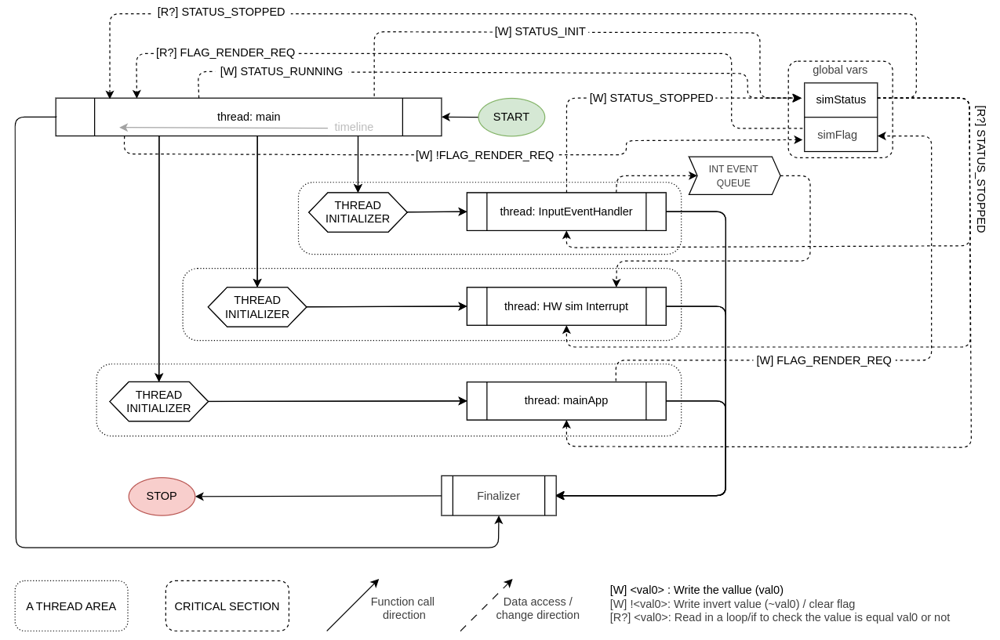

# ABOUT

This project is made to develop the UI (from scratch). I realize that every time I want to see the changes, I have to wait for flashing... It takes a lot of my time!

# How does it work

## Architecture

To start the simulation, you need to define pseudo hardware API (including GPIO control, screen control, interrupt, ...). Because of the limit of technical, i can not simulation interrupt same as real-life (the way CPU work); I can only provide the `negInterruptRegister` and `posInterruptRegister` to help you know when the interrupt happends. 

```
    +------------------------------+
    | CODE IN `src` (to be sim)    |
    +------------------------------+
    | USER'S RE-DEF API            |
    +------------------------------+
    | PSEUDO HW API (GPIO/INT)     |
    +------------------------------+
    | CORE UI (USING SDL)          |
    +------------------------------+
```

## Directory tree

```
    ├── Makefile            # build script
    ├── README.md
    ├── app
    ├── app.c               # application logic (UI, ...)
    ├── app.o
    ├── config              # config of simulation
    │   ├── color.h
    │   └── config.h
    ├── include             # headers of simulation
    │   ├── app.h
    │   ├── global.h
    │   └── sim_api.h
    ├── leak_check.txt
    ├── lib                 # local lib for simulation
    │   ├── log
    │   │   ├── log.c
    │   │   ├── log.h
    │   │   └── log.o
    │   └── queue
    │       ├── queue.c
    │       ├── queue.h
    │       └── queue.o
    ├── src                 # The source code is being simulated
    │   ├── include
    │   │   └── main.h
    │   ├── main.c
    │   └── main.o
    └── valgrind.5989.log
```

**Note:**  
- `src/` here simulates the same structure as PlatformIO’s `src/`.  
  When running on PC, this directory contains the simulation entry (`main.c`).  
  When flashing to hardware, this will be replaced by the actual firmware `src/`.  
- `app/`, `lib/`, and `config/` are designed to be portable across both simulation and real firmware.  

## Flowchart

### Simplified flowchart and dataflow

The core variables of the project are  `simFlag`, `simStatus`, `simInterruptEventQueue`. They control most of the behavior of the simulation. The orders just created to make the simulation safer!



The **inputEventHandler** control the defined event (like `quit`, `HW interrupt simulation`).

# Collection

## Enum

- Name for enum: LIB+CATALOG+PROPERTY (E.g: INT_STATUS_OK (interrupt/status/OK)
- Enum make the code is more readable, keep the flow is clear!

## Functions

- Declare a pointer function `f` : `void (*f)(void)`  
- To call a pointer function: `f()` - implicit dereference or `(*f)()` - explicit dereference
- `typedef void (*simISRFuncPtr_t)(void);` : Define a void (*...)(void) type (a pointer to a function that take no arg and return nothing)
- If a function can be referenced by an address like a variable, the address can be stored in an array! E.g: `void (*f[23])(void)` - `f` is a function pointer array with the size is 23.
- Assign a slot `f[3] = foo` (which foo: `void foo(){ printf"Hello, I'm foo!");}`)
- Call a slot inside `f` : `f[3]()` or `*(f+3)()` or `(*(*(f+3)))()`

## log

- Using __VAR_ARGS__ (in  `stdarg.h` ) to pass unknown size angs
- The core log function: `void __sim_coreLog(const char* tag, const char* format, ...) __attribute__((format(printf, 2, 3)));`
- The `__attribute__((format(printf, 2, 3)))` tells the compiler that check 2nd-arg (format) and args (...) same as printf. (It will give the warning of you pass format as a integer).
- Use `va_start(<va_list>, the last fixed arg)` to collect all args from `...`
- Use `stderr` to log, it not conflic with `stdout` (normal printf) 

The full definition of __sim_coreLog:
```C
    void __sim_coreLog(const char* tag, const char* format, ...) {
        struct timeval __timeVal;
        gettimeofday(&__timeVal, NULL);

        struct tm __tmBuf;
        localtime_r(&__timeVal.tv_sec, &__tmBuf);

        char __buffer[32];
        strftime(__buffer, sizeof(__buffer), "%H:%M:%S", &__tmBuf);

        va_list args;
        va_start(args, format);
        fprintf(stderr, "[%s.%06ld] [%s] ", __buffer, __timeVal.tv_usec, tag);
        vfprintf(stderr, format, args);
        fprintf(stderr, "\n");
        va_end(args);
    }
```

# DEMO


